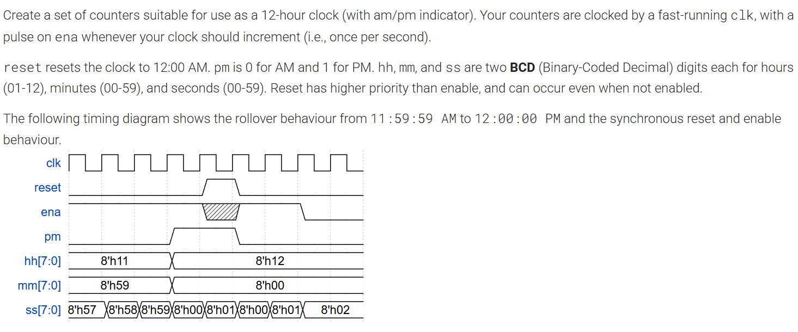

# 🕐 12-Hour Clock

> HDLBits problem — a 12-hour digital clock implemented using
> cascaded BCD counters with AM/PM indicator in Verilog HDL.

---

## 📋 Problem Source

**Platform:** [HDLBits](https://hdlbits.01xz.net/wiki/Exams/ece241_2014_q7b)
**Category:** Sequential Logic — Counters
**Status:** ✅ Solved

---

## 📌 Problem Statement

Design a set of cascaded counters for a **12-hour clock** with
AM/PM indicator. The clock is driven by a fast-running `clk`,
with `ena` pulsed once per second to increment time.

### Key Specifications
- Time displays in **BCD (Binary Coded Decimal)** format
- Hours range: **01–12**
- Minutes range: **00–59**
- Seconds range: **00–59**
- `reset` resets clock to **12:00:00 AM** (higher priority than enable)
- `pm` is **0 for AM**, **1 for PM**
- AM/PM toggles at **11:59:59 → 12:00:00**
- Clock rolls over correctly at **12:59:59 → 01:00:00**

---

## 🧠 Design Details

| Parameter | Details |
|-----------|---------|
| Counter Type | Cascaded BCD |
| Hours | 2-digit BCD (01–12) |
| Minutes | 2-digit BCD (00–59) |
| Seconds | 2-digit BCD (00–59) |
| Reset | Synchronous, active high |
| Enable | Active high, once per second |
| Language | Verilog HDL |

### BCD Encoding
Each output is 8-bit split into two BCD nibbles:

| Bits | Meaning |
|------|---------|
| [7:4] | Tens digit |
| [3:0] | Units digit |

---

## 📊 Module I/O

### Inputs
| Signal | Width | Description |
|--------|-------|-------------|
| clk | 1-bit | Fast system clock |
| reset | 1-bit | Synchronous reset to 12:00:00 AM |
| ena | 1-bit | Enable — pulses once per second |

### Outputs
| Signal | Width | Description |
|--------|-------|-------------|
| pm | 1-bit | 0 = AM, 1 = PM |
| hh | 8-bit | Hours in BCD (01–12) |
| mm | 8-bit | Minutes in BCD (00–59) |
| ss | 8-bit | Seconds in BCD (00–59) |

---

## ✨ Key Implementation Details

- Hours counter handles **non-standard BCD rollover** at 12
  (jumps to 01 instead of 00)
- BCD increment logic handles **tens digit carry** correctly
  for all three counters
- **AM/PM toggles** when hours transition from 11 → 12
- Reset has **higher priority** than enable — works even
  when ena is low

---

## 📁 Files

- `12_hour_clock.v` — Verilog RTL solution
- `question.png` — Original HDLBits problem screenshot
- `README.md`

> Note: No testbench included — solution verified through
> HDLBits internal simulator and grader.

---

## 🛠️ Tools Used

| Tool | Purpose |
|------|---------|
| Verilog HDL | Hardware Description Language |
| HDLBits | Online Verilog practice platform |

---

## 🏫 Institution

**Birla Institute of Technology, Mesra**
Department of Electronics & Communication Engineering
Batch of 2028
